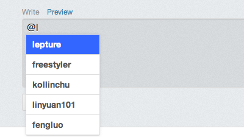

## What is

At.js is what you can guess from the picture bellow.

## Live Demo

Hi, type `@` for a try!
<textarea></textarea>
Actually it's not just a mention, there are more waiting for you! **Type** `:` and have fun!

It is just designed to do the twitter-like mention job, however you can do whatever you want! 
For example, **Type** `:` to complete emoji as I mentioned above.

**The only limitation is your imagination.**

## Support Browsers

* 
* 
* 
* 

## How to use

    var names = ["Jacob","Isabella","Ethan","Emma"];
    var emojis = ["smile", "heart"];
    $('textarea').atWho('@', {
        data: names
    }).atWho(':', {
        data: emojis
    });

**More details at [Documention](documention.html) or [Wiki][wiki]**

If you have any problem, feel free to [post a issue][issues]

## Requirements

* jQuery 1.7.0+

## Who is using

* [Ruby China][ruby_china]
* [Python China][python_china]

Find more on the [Wiki Sites][wiki_sites]

**Adn if you are using At.js, please add your site into this wiki**

[wiki]: https://github.com/ichord/At.js/wiki "At.js - Wiki"
[issues]: https://github.com/ichord/At.js/issues "Github Issues"
[wiki_sites]: https://github.com/ichord/At.js/wiki/Sites "Sites"
[ruby_china]: http://ruby-china.org/
[python_china]: http://python-china.org/
